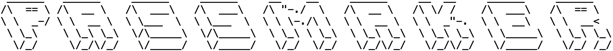

### A password generator CLI written in Python.

This password generator has sets variability and security as first order priorities. pyton-passmaker chooses and indeterminate amount of each character type to add to the final password. This increases the variability of the password and presents users with the ability to regenerate the password immediately if it does not fulfill their criteria. (If the password doesn't meet your needs hit 'Y' to regenerate!)

### Prerequisites

Python 3.8 +